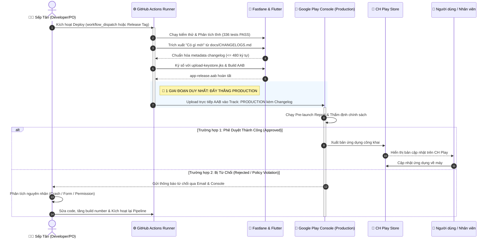

# 🚀 SƠ ĐỒ & QUY TRÌNH TỰ ĐỘNG HÓA CI/CD DEPLOYMENT (VCLOUD)
> **Tài liệu chuẩn hóa:** `docs/CICD_AUTO_DEPLOY_PIPELINE.md`  
> **Áp dụng cho:** Hệ sinh thái **VCloud Mobile (`vclients`)** — iOS (Apple TestFlight) & Android (Google Play Console)  
> **Mô hình phát hành:** **1 Giai đoạn trực tiếp (Direct to Production)** — Phê duyệt bởi: **Sếp Tân**

---

## 1. 🏛️ TỔNG QUAN KIẾN TRÚC TỰ ĐỘNG HÓA (1 GIAI ĐOẠN — DIRECT TO PRODUCTION)

Theo định hướng tối ưu hóa và tinh gọn quy trình của Sếp Tân (phát triển và vận hành trực tiếp, không qua đội tester trung gian):
- **1 Giai đoạn duy nhất (Zero-Intermediary)**: Bản dựng Android `.aab` được đẩy **thẳng trực tiếp lên Kênh Sản Xuất (Production Track)** trên Google Play Console. Không đi qua kênh thử nghiệm nội bộ (Internal Testing) gây chậm trễ.
- **Tự động hóa hoàn toàn (Zero-Touch)**: Kích hoạt qua `workflow_dispatch` hoặc Git Release Tag. Hệ thống tự chạy linter, 336+ unit tests, ký số tự động, tự trích xuất "Có gì mới" từ `CHANGELOGS.md` và tải lên Store.
- **Vòng lặp phản hồi nhanh (Fail-Fast & Fix)**: Khi Google Review duyệt đạt, bản cập nhật lên thẳng CH Play. Nếu có bất kỳ lý do từ chối nào (chính sách, form giải trình hoặc crash bot), Sếp Tân kiểm tra log, fix lỗi và kích hoạt lại pipeline.

---

## 2. 🎭 SƠ ĐỒ USE CASE HỆ THỐNG PHÁT HÀNH (USE CASE DIAGRAM)

```text
========================================================================================================================
                                     VCLOUD MOBILE CI/CD & DEPLOYMENT SYSTEM
========================================================================================================================

           [ ACTORS ]                                                                     [ ACTORS ]

         ┌─────────────┐                                                                ┌────────────────┐
         │             │                                                                │                │
         │   Sếp Tân   │                                                                │  Google Play   │
         │ (Developer) │                                                                │    Reviewer    │
         │             │                                                                │   & Store Bot  │
         └──────┬──────┘                                                                └───────┬────────┘
                │                                                                               │
                │ 1. Kích hoạt phát hành                                                        │
                ├──────────────────────────────────────────────────────┐                        │
                │                                                      │                        │
                │                                                      ▼                        │
                │                                       ┌─────────────────────────────┐         │
                │                                       │ UC1: Kích hoạt Pipeline CI  │         │
                │                                       └──────────────┬──────────────┘         │
                │                                                      │                        │
                │                                          <<include>> ├────────────────────────┤
                │                                                      ▼                        │
                │                                       ┌─────────────────────────────┐         │
                │                                       │ UC2: Kiểm thử & Phân tích   │         │
                │                                       │  (flutter analyze & 336 test│         │
                │                                       └──────────────┬──────────────┘         │
                │                                                      │                        │
                │                                          <<include>> ├────────────────────────┤
                │                                                      ▼                        │
                │                                       ┌─────────────────────────────┐         │
                │                                       │ UC3: Trích xuất Changelog   │         │
                │                                       │  (Auto extract từ docs/...) │         │
                │                                       └──────────────┬──────────────┘         │
                │                                                      │                        │
                │                                          <<include>> ├────────────────────────┤
                │                                                      ▼                        │
                │                                       ┌─────────────────────────────┐         │
                │                                       │ UC4: Ký số & Đóng gói .AAB  │         │
                │                                       │ (Keystore & Release Bundle) │         │
                │                                       └──────────────┬──────────────┘         │
                │                                                      │                        │
                │                                          <<include>> ├────────────────────────┤
                │                                                      ▼                        │
                │                                       ┌─────────────────────────────┐         │
                │                                       │ UC5: Deploy Thẳng Production│         │
                │                                       │ (1 Giai đoạn - Direct Track)│◄────────┤ 2. Thẩm định AAB &
                │                                       └──────────────┬──────────────┘         │    kiểm tra chính sách
                │                                                      │                        │
                │                                                      ▼                        │
                │                                       ┌─────────────────────────────┐         │
                │                                       │ UC6: Đánh giá & Kiểm duyệt  │◄────────┘
                │                                       └──────────────┬──────────────┘
                │                                                      │
                │                         ┌────────────────────────────┴────────────────────────────┐
                │                         │ [Kết quả: PASS]                                         │ [Kết quả: REJECT]
                │                         ▼                                                         ▼
                │          ┌─────────────────────────────┐                           ┌─────────────────────────────┐
                │          │ UC7: Phát hành lên CH Play  │                           │ UC8: Nhận thông báo từ chối │
                │          │   (Công chúng tải về)       │                           │  (Google Play Console/Mail) │
                │          └──────────────┬──────────────┘                           └──────────────┬──────────────┘
                │                         │                                                         │
                │                         │                                                         │ 3. Sửa lỗi & Deploy lại
                │                         │                                                         ▼
                │                         │                                          ┌─────────────────────────────┐
                │                         │                                          │ UC9: Khắc phục & Tái nạp    │
                │                         │                                          │  (Fix root cause & Redeploy)│
                │                         │                                          └──────────────┬──────────────┘
                │                         │                                                         │
                │                         │                                                         └───────► (Quay lại UC1)
                │                         │
                ▼                         ▼
         ┌──────────────┐          ┌──────────────┐
         │  Apple App   │          │  Người Dùng  │
         │Store Connect │          │ (Nhân viên / │
         │ (TestFlight) │          │  Khách hàng) │
         └──────────────┘          └──────────────┘
```

---

## 3. 📋 MA TRẬN ĐẶC TẢ USE CASE (USE CASE SPECIFICATIONS)

| Mã Use Case | Tên Use Case | Tác nhân chính (Actor) | Mô tả chi tiết hành động | Điều kiện kích hoạt & Kết quả |
| :--- | :--- | :--- | :--- | :--- |
| **UC1** | Kích hoạt Pipeline CI/CD | Sếp Tân | Bấm `Run workflow` trên GitHub Actions hoặc tạo Git Release Tag `v*`. | **Input:** Branch `main` + Build target (`android`, `ios`, `all`). |
| **UC2** | Kiểm thử & Phân tích Tự động | GitHub Actions | Chạy `flutter analyze` (yêu cầu 0 errors/warnings) và chạy bộ 336 bài test tự động. | **Rule:** Bất kỳ lỗi nào sẽ dừng ngay lập tức (Fail-fast). |
| **UC3** | Tự động Trích xuất "Có gì mới" | Fastlane Engine | Đọc phiên bản từ `pubspec.yaml`, quét đúng mục trong `docs/CHANGELOGS.md`, làm sạch và chuẩn hóa `<= 480 ký tự`. | **Artifact:** File `metadata/android/{vi-VN,en-US}/changelogs/<build>.txt`. |
| **UC4** | Ký số Bảo mật & Biên dịch | GitHub Actions | Giải mã `upload-keystore.jks` từ Secret Base64, thiết lập `key.properties`, biên dịch APK và AAB. | **Artifact:** `app-release.aab` và `app-release.apk`. |
| **UC5** | Deploy 1 Giai Đoạn Thẳng Production | Fastlane `upload_to_play_store` | Tải trực tiếp file `.aab` vào **Kênh Sản Xuất (Production Track)** với `skip_upload_changelogs: false`. Không qua Internal Test. | **Target:** Package `com.mobile.vloud`, Track: `production`. |
| **UC6** | Kiểm duyệt Chính sách Google | Google Play Reviewer / Bot | Google quét phân tích mã nguồn (Pre-launch report), kiểm tra quyền (Permissions), kiểm tra crash khi khởi động. | Thời gian duyệt: Thường từ vài giờ đến 1 ngày đối với bản cập nhật. |
| **UC7** | Phát hành Công khai lên CH Play | Google Play Console | Bản phát hành được phê duyệt, ứng dụng tự động hiển thị nút Cập nhật trên CH Play cho tất cả người dùng. | **End User:** Nhân viên mở CH Play và nhận bản mới. |
| **UC8** | Xử lý Từ chối Phát hành (Reject) | Google Review ➔ Sếp Tân | Google gửi thông báo lý do từ chối (ví dụ: vi phạm chính sách quyền, crash bot test, thiếu khai báo form). | Sếp Tân xem chi tiết trong Google Play Console mục Hộp thư đến / Bản phát hành. |
| **UC9** | Khắc phục & Tái nạp Bản Dựng | Sếp Tân | Sếp Tân fix lỗi ở mã nguồn, tăng `build_number` trong `pubspec.yaml`, cập nhật `CHANGELOGS.md` và kích hoạt lại UC1. | Tạo bản dựng mới thay thế bản cũ bị từ chối. |

---

## 4. 🔄 BIỂU ĐỒ TRÌNH TỰ (SEQUENCE DIAGRAM - 1 GIAI ĐOẠN THẲNG PRODUCTION)



---

## 5. 🎯 CÁC ĐIỂM CỐT LÕI CỦA MÔ HÌNH 1 GIAI ĐOẠN

1. **Không có độ trễ thử nghiệm nội bộ**:
   - Tiết kiệm thời gian và thao tác so với quy trình cũ phải upload vào `internal` rồi vào web console bấm nút *Quảng bá bản phát hành (Promote release)* sang `production`.
2. **Khai báo cấu hình đồng bộ**:
   - `Fastfile`: `play_track = ENV["GOOGLE_PLAY_TRACK"] || "production"`
   - GitHub Workflow: `GOOGLE_PLAY_TRACK: ${{ vars.GOOGLE_PLAY_TRACK || secrets.GOOGLE_PLAY_TRACK || 'production' }}`
3. **Chiến lược an toàn khi bị từ chối**:
   - Google Play cho phép nạp bản sửa lỗi với mã phiên bản mới (`build_number` mới) mà không ảnh hưởng đến bản ứng dụng hiện tại đang hoạt động của người dùng.
   - Luôn tuân thủ quy tắc tăng mã phiên bản trong `pubspec.yaml` trước khi kích hoạt build lại.
