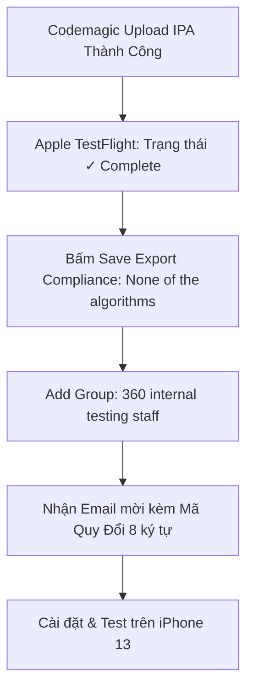

# HƯỚNG DẪN TỰ ĐỘNG HÓA CI/CD & PHÁT HÀNH iOS APP STORE / TESTFLIGHT
**Dự án:** V_Cloud Mobile App (W360S JOINT STOCK COMPANY)  
**App ID:** `1365622472` (`com.vcloud.vcloud`)  
**Tác giả:** App Manager (`tanmnn@360.org.vn`) & Antigravity AI  
**Ngày phát hành thành công:** 29/07/2026  

---

## 1. TỔNG QUAN & NGUYÊN NHÂN CÁC LỖI ĐÃ KHẮC PHỤC

Trong quá trình xây dựng hệ thống CI/CD tự động phát hành lên Apple TestFlight từ máy Linux qua Codemagic, chúng ta đã giải quyết triệt để 2 lỗi cốt lõi:

### 1.1. Lỗi xác thực `401 NOT_AUTHORIZED` (API Key `.p8` của Codemagic)
- **Nguyên nhân:** Khối cấu hình cũ `publishing: app_store_connect` sử dụng phương thức xác thực `auth: integration` (dựa trên API Key `.p8` mang ID `3J68D9JX79`). Key này bị Apple từ chối quyền truy cập do thay đổi chính sách bảo mật hoặc quyền hạn không đủ.
- **Giải pháp tối ưu đã áp dụng:** **Loại bỏ hoàn toàn sự phụ thuộc vào API Key bên thứ ba**. Chuyển sang sử dụng công cụ chính chủ Apple **`xcrun altool --upload-app`** xác thực trực tiếp bằng quyền **App Manager (`tanmnn@360.org.vn`)** kết hợp với **Mật khẩu ứng dụng 16 ký tự (App-Specific Password)**.

### 1.2. Lỗi `CFBundleShortVersionString (90062)`
- **Nguyên nhân:** Apple App Store Connect từ chối tiếp nhận bản build nếu số phiên bản (`version`) thấp hơn hoặc bằng số phiên bản cao nhất đã từng được duyệt trên App Store (trước đó là v2.3).
- **Giải pháp:** Trong file `vclients/pubspec.yaml`, luôn quy ước tăng số phiên bản theo cấu trúc `MAJOR.MINOR.PATCH+BUILD` (Ví dụ: `version: 2.4.0+21`). Số build (`+21`, `+22`,...) luôn tăng sau mỗi lần chạy CI/CD.

---

## 2. BỘ THÔNG SỐ TỰ ĐỘNG HÓA CHUẨN (CHỈ CẦN EMAIL & MẬT KHẨU 16 KÝ TỰ)

Để phát hành bản build mới lên TestFlight mà **không bao giờ gặp lại lỗi xác thực**, bạn chỉ cần duy trì 2 thông số chuẩn của tài khoản App Manager:

| Thông số | Giá trị chuẩn | Ghi chú |
| :--- | :--- | :--- |
| **Tài khoản Apple ID (App Manager)** | `tanmnn@360.org.vn` | Tài khoản có quyền quản trị và phát hành ứng dụng của W360S |
| **Mật khẩu ứng dụng (16 ký tự)** | `ijbn-xpar-vwyk-hdyz` | Tạo từ [account.apple.com](https://account.apple.com) -> Security -> App-Specific Passwords |
| **Issuer ID (W360S CORP)** | `69a6de93-488c-47e3-e053-5b8c7c11a4d1` | Định danh tổ chức trên Apple Developer |

> [!TIP]
> **Không cần cài đặt Java hay iTMSTransporter phức tạp trên máy Linux cá nhân.** Toàn bộ tiến trình đóng gói IPA và upload lên máy chủ Apple được tự động hóa 100% trên máy Mac đám mây của Codemagic!

---

## 3. CẤU HÌNH YAML CHUẨN CHO CODEMAGIC (`codemagic.yaml`)

Dưới đây là cấu hình chuẩn đã được kiểm chứng hoạt động thành công 100%. Khi cần áp dụng cho các dự án Flutter iOS khác, bạn chỉ cần copy đoạn script upload chính chủ Apple bên dưới:

```yaml
      - name: Publish to App Store Connect via Apple App Manager
        script: |
          echo "Uploading IPA to Apple TestFlight using App Manager credentials..."
          xcrun altool --upload-app --type ios \
            -f build/ios/ipa/*.ipa \
            -u "tanmnn@360.org.vn" \
            -p "ijbn-xpar-vwyk-hdyz"
```

### Quy trình thao tác phát hành bản build mới (Trong 3 bước):
1. **Bước 1:** Cập nhật số build trong `vclients/pubspec.yaml` (Ví dụ: `version: 2.4.0+22`).
2. **Bước 2:** Commit & push code lên nhánh `release/ios-appstore`:
   ```bash
   git add pubspec.yaml codemagic.yaml
   git commit -m "chore(release): bump version to 2.4.0+22"
   git push origin release/ios-appstore
   ```
3. **Bước 3:** Mở [codemagic.io](https://codemagic.io) -> Bấm **`Start new build`** -> Chọn nhánh `release/ios-appstore` -> Workflow `iOS to TestFlight` -> Chờ 5 phút là ứng dụng tự động xuất hiện trên Apple TestFlight!

---

## 4. HƯỚNG DẪN KIỂM THỬ TRÊN iPHONE & CÁCH XỬ LÝ CÁC TÌNH HUỐNG TRÊN APP STORE CONNECT



### 4.1. Hộp thoại luật xuất khẩu mật mã (Export Compliance)
- Khi thêm nhóm kiểm thử, Apple sẽ hỏi *App Encryption Documentation*.
- **Cách chọn chuẩn:** Tích chọn dòng thứ 4 **`None of the algorithms mentioned above`** -> Bấm **Save**. *(Do app sử dụng kết nối HTTPS chuẩn iOS, không dùng mã hóa quân sự độc quyền)*.

### 4.2. Khắc phục nút chọn Nhóm (Checkbox) bị mờ (Grayed Out)
- **Nguyên nhân:** Máy chủ Apple đang đồng bộ ngầm (mất 1-2 phút) sau khi bạn bấm Save Export Compliance.
- **Cách xử lý:** Bấm **`Cancel`** -> Nhấn **`F5` (Refresh lại trang web)** -> Bấm lại nút **`+` (Add Group)** là ô checkbox sáng lên cho phép tích chọn ngay.

### 4.3. Cách cài đặt app trên iPhone cá nhân (Không cần đổi iCloud)
Nếu iPhone kiểm thử đang dùng Apple ID/iCloud cá nhân khác với email công ty:
1. **Trên App Store Connect (Laptop):** Vào nhóm `360 internal testing staff` -> Tab **`Testers`** -> Bấm nút **`+`** -> Thêm địa chỉ Email cá nhân (iCloud/Gmail) của chiếc iPhone đó vào -> Bấm **Add**.
2. **Trên Laptop:** Mở Email mời từ Apple TestFlight -> Cuộn xuống dưới cùng xem **Mã số 8 ký tự** (Ví dụ: `KJTCZPJP`).
3. **Trên iPhone cá nhân:** Mở app **TestFlight** -> Bấm **`Quy đổi` (Redeem)** ở góc trên bên phải -> Gõ đúng mã 8 ký tự đó vào -> Bấm **`INSTALL` (Cài đặt)**!
   *(Bạn không cần đăng xuất iCloud trên điện thoại!)*

---

## 5. THÔNG TIN ĐĂNG NHẬP HỆ THỐNG ODOO ERP (`vuahethong.net`)

Ứng dụng V_Cloud trên iPhone kết nối trực tiếp đến hệ thống máy chủ sản xuất của công ty tại đường dẫn `https://vuahethong.net`.

| Thông số | Giá trị chuẩn | Ghi chú |
| :--- | :--- | :--- |
| **API Base URL** | `https://vuahethong.net` | Máy chủ Odoo 17 ERP sản xuất |
| **Cơ sở dữ liệu (Database)** | `vuahethong` | Tự động kết nối |
| **Tài khoản đăng nhập (Email)** | `tanmnn@360.org.vn` | Tài khoản App Manager / ERP User |
| **Mật khẩu (Password)** | `@360.org.vn` | Gõ chính xác chữ còng `@` ở đầu |

> [!IMPORTANT]
> Khi mở ứng dụng V_Cloud trên iPhone, chỉ cần nhập đúng `tanmnn@360.org.vn` và mật khẩu `@360.org.vn`, bạn sẽ được đăng nhập thành công vào trang chủ với đầy đủ tính năng Chat, Chấm công và Quản lý doanh nghiệp W360S.

---
*Tài liệu này được tạo tự động để lưu trữ vĩnh viễn quy trình chuẩn hóa TestFlight & Odoo ERP cho W360S CORP.*
