# Activity Diagram — Push Gateway API v1 (Bản Phóng To Đầy Đủ)

**Document:** `docs/diagrams/push_gateway/push_gateway_activity_diagram.md`
**Bản HTML trực quan có bộ công cụ Phóng to / Thu nhỏ (Zoom In/Out):** [`push_gateway_activity_diagram.html`](push_gateway_activity_diagram.html)
**Tiêu chuẩn biểu diễn:** UML 2.0 Activity Diagram phân luồng bơi (Swimlanes), font chữ lớn, bố cục rộng rãi chống cắt chữ.

---

## 1. Sơ đồ Activity Diagram Chi Tiết (Mermaid Markdown)

```mermaid
flowchart TD
    %% ==========================================
    %% KHAI BÁO CLASS STYLES CỠ CHỮ LỚN, KHÔNG BỊ CẮT CHỮ
    %% ==========================================
    classDef startEnd fill:#0f172a,stroke:#38bdf8,stroke-width:3px,color:#ffffff,font-size:18px,font-weight:bold;
    classDef action fill:#0077cd,stroke:#004b87,stroke-width:2px,color:#ffffff,font-size:16px,font-weight:bold,rx:12,ry:12;
    classDef decision fill:#d97706,stroke:#92400e,stroke-width:2px,color:#ffffff,font-size:15px,font-weight:bold;
    classDef forkJoin fill:#0f172a,stroke:#38bdf8,stroke-width:8px,color:#ffffff,font-size:15px,font-weight:bold;
    classDef success fill:#059669,stroke:#065f46,stroke-width:2px,color:#ffffff,font-size:16px,font-weight:bold,rx:12,ry:12;
    classDef cancel fill:#dc2626,stroke:#991b1b,stroke-width:2px,color:#ffffff,font-size:16px,font-weight:bold,rx:12,ry:12;

    %% ==========================================
    %% PHÂN VÙNG 1: TENANT ODOO 19
    %% ==========================================
    subgraph TENANT[" 🏢 PHÂN VÙNG: TENANT ODOO 19 (Client / Nguồn Sự Kiện) "]
        node_start((● BẮT ĐẦU)):::startEnd
        act_receive["📥 Nhận sự kiện có tin nhắn chat mới<br/>(Business Chat Message)"]:::action

        fork_trans["━ FORK BAR: Tách luồng Transaction Nghiệp vụ ━"]:::forkJoin

        act_save_msg["💾 1. Lưu bản ghi tin nhắn chat<br/>vào Database (mail.message)"]:::action
        act_create_outbox["📝 2. Tạo bản ghi Hàng đợi Outbox<br/>- Model: vmobile.push.outbox<br/>- Sinh event_id chuẩn hóa<br/>- expire_at = now + 5 phút<br/>- state = pending"]:::action

        join_trans["━ JOIN BAR: Đồng bộ cam kết giao dịch ━"]:::forkJoin

        act_commit["✅ COMMIT Transaction DB thành công<br/>(Dữ liệu nghiệp vụ an toàn 100%)"]:::action

        act_worker["⚙️ Outbox Worker / Cron Job định kỳ<br/>quét các bản ghi pending hợp lệ"]:::action

        dec_expire{"❓ Đã quá hạn<br/>expire_at (5 phút)?"}:::decision

        act_mark_expired["⛔ Chuyển state = expired<br/>(Hủy bỏ, chống bắn tin rác cũ)"]:::cancel

        act_send_http["🚀 Bắn POST /api/v1/sso/push/send<br/>qua HTTPS + Bearer Tenant Secret"]:::action

        dec_retry{"❓ Lỗi mạng / 503 / 504<br/>Số lần thử lại < 3?"}:::decision

        act_calc_backoff["⏳ Lùi thời gian thử lại (+30s / +60s / +120s)<br/>Cập nhật next_retry_at & state = pending"]:::action
        act_mark_failed["❌ Chuyển state = failed<br/>(Dừng retry, ghi log báo cáo)"]:::cancel
        act_mark_sent["🎉 Chuyển state = sent<br/>(Hoàn tất nghiệp vụ Outbox)"]:::success
    end

    %% ==========================================
    %% PHÂN VÙNG 2: MASTER ODOO 17 GATEWAY
    %% ==========================================
    subgraph MASTER[" 🏰 PHÂN VÙNG: MASTER ODOO 17 (vuahethong.net - Push Gateway Hub) "]
        act_recv_req["📥 Tiếp nhận request từ Tenant Odoo 19"]:::action

        dec_auth{"❓ Bearer Secret hợp lệ &<br/>Tenant đang active?"}:::decision
        act_err_401["🚫 Phản hồi HTTP 401 Unauthorized / 403 Forbidden"]:::cancel

        act_auto_provision["⚡ Tự Động Cấp Phát Tenant (Zero-Touch):<br/>- Kiểm tra mobile_push_gateway_tenant<br/>- Chưa có -> Tự INSERT tenant_code & base_url<br/>- Kích hoạt active = True cho Smart Login"]:::action

        dec_idempotent{"❓ event_id đã tồn tại trong<br/>vmobile.push.event (Idempotency)?"}:::decision
        act_dup_200["🔁 Phản hồi HTTP 200 OK<br/>status = duplicate (Bỏ qua gửi trùng)"]:::action

        act_create_event["📋 Ghi nhận event_id vào vmobile.push.event<br/>(Đánh dấu trạng thái: received)"]:::action

        fork_resp["━ FORK BAR: Tách luồng phản hồi tức thì & Dispatch FCM ━"]:::forkJoin

        act_ret_200["⚡ Phản hồi HTTP 200 OK ngay lập tức<br/>status = accepted + details.unresolved"]:::action

        act_resolve_device["🔍 Tra cứu danh bạ thiết bị mobile.api.device<br/>Khóa tìm: (tenant_id, user_login, active = True)"]:::action

        dec_has_device{"❓ Tìm thấy thiết bị<br/>đang hoạt động?"}:::decision

        act_log_unresolved["⚠️ Ghi log unresolved: User chưa cài app / chưa có token"]:::action

        act_build_fcm["📦 Đóng gói payload FCM v1 &<br/>Lấy Google OAuth2 Access Token (google-auth)"]:::action

        act_dispatch_fcm["📡 Đẩy lệnh sang Google FCM API v1<br/>(Giao thức HTTP/2 ngầm, độ trễ 0ms)"]:::action
    end

    %% ==========================================
    %% PHÂN VÙNG 3: FCM & FLUTTER VCLOUD APP
    %% ==========================================
    subgraph FCM_APP[" 📱 PHÂN VÙNG: GOOGLE FCM & FLUTTER VCLOUD APP "]
        act_fcm_route["🛰️ Hạ tầng Google FCM định tuyến sóng<br/>đến đúng thiết bị người nhận"]:::action

        act_show_notif["🔔 Điện thoại hiển thị Push Notification Banner<br/>(Tiêu đề: Tên người gửi, Nội dung: Tóm tắt chat)"]:::action

        act_user_tap["👆 Người dùng bấm (Tap) vào thông báo"]:::action

        act_open_chat["🚀 App Vcloud mở và Deep Link trực tiếp<br/>vào đúng phòng chat (channel_id & message_id)"]:::success

        node_end(((◉ KẾT THÚC))):::startEnd
    end

    %% ==========================================
    %% CÁC ĐƯỜNG KẾT NỐI ĐIỀU HƯỚNG RÕ RÀNG
    %% ==========================================
    node_start --> act_receive
    act_receive --> fork_trans

    fork_trans --> act_save_msg
    fork_trans --> act_create_outbox

    act_save_msg --> join_trans
    act_create_outbox --> join_trans
    join_trans --> act_commit

    act_commit --> act_worker
    act_worker --> dec_expire

    dec_expire -- "⛔ Đúng: Đã quá 5 phút" --> act_mark_expired
    dec_expire -- "✅ Sai: Tin còn mới" --> act_send_http

    act_send_http --> act_recv_req
    act_recv_req --> dec_auth

    dec_auth -- "❌ Sai Secret" --> act_err_401
    act_err_401 --> act_mark_failed

    dec_auth -- "✅ Hợp lệ" --> act_auto_provision
    act_auto_provision --> dec_idempotent

    dec_idempotent -- "🔁 Đã gửi rồi (Duplicate)" --> act_dup_200
    act_dup_200 --> act_mark_sent

    dec_idempotent -- "🆕 Sự kiện mới" --> act_create_event
    act_create_event --> fork_resp

    %% Nhánh phản hồi nhanh về cho Tenant
    fork_resp --> act_ret_200
    act_ret_200 --> act_mark_sent

    %% Nhánh gửi ngầm qua Google FCM
    fork_resp --> act_resolve_device
    act_resolve_device --> dec_has_device

    dec_has_device -- "❌ Không có máy" --> act_log_unresolved
    act_log_unresolved --> node_end

    dec_has_device -- "✅ Có máy nhận" --> act_build_fcm
    act_build_fcm --> act_dispatch_fcm

    act_dispatch_fcm --> act_fcm_route
    act_fcm_route --> act_show_notif
    act_show_notif --> act_user_tap
    act_user_tap --> act_open_chat
    act_open_chat --> node_end

    %% Luồng xử lý Retry khi gặp sự cố mạng
    act_send_http -.->|"⚠️ Lỗi mạng / Timeout"| dec_retry
    dec_retry -- "✅ Còn lượt (< 3 lần)" --> act_calc_backoff
    act_calc_backoff --> act_worker
    dec_retry -- "❌ Hết lượt (≥ 3 lần)" --> act_mark_failed
    act_mark_failed --> node_end
    act_mark_expired --> node_end
```

---

## 2. Các điểm nâng cấp hiển thị trong phiên bản mới:
1. **Font chữ phóng to toàn diện**: Tăng kích cỡ chữ trong tất cả các Node (Action, Decision, Fork/Join, Start/End) lên từ 16px - 20px, chữ đậm, sắc nét trên màn hình Retina / 4K.
2. **Không gian thở (Spacing) mở rộng**: Tăng khoảng cách hàng (`rankSpacing: 65`) và khoảng cách cột (`nodeSpacing: 55`), bọc padding 25px xung quanh chữ, đảm bảo chữ tiếng Việt có dấu (`ắ`, `ế`, `ộ`, `đ`) không bị chạm mép khung viền.
3. **Thanh công cụ thu phóng tương tác (Zoom In / Zoom Out)**: Đã tích hợp sẵn trên file HTML 3 nút bấm phóng to (`+`), thu nhỏ (`-`) và đặt lại kích thước (`100%`) giúp Sếp tự do căn chỉnh tỷ lệ hiển thị theo ý muốn.
4. **Màu sắc tương phản chuẩn UX**: Áp dụng nền Dark Theme sang trọng (`#0f172a`), khung sơ đồ Whiteboard tương phản cao (`#ffffff`) giúp đọc lướt các luồng quyết định cực kỳ rõ nét.
